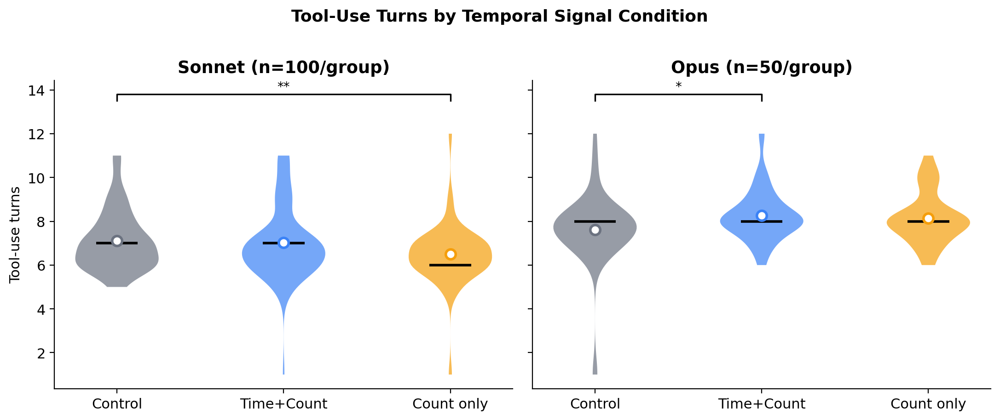
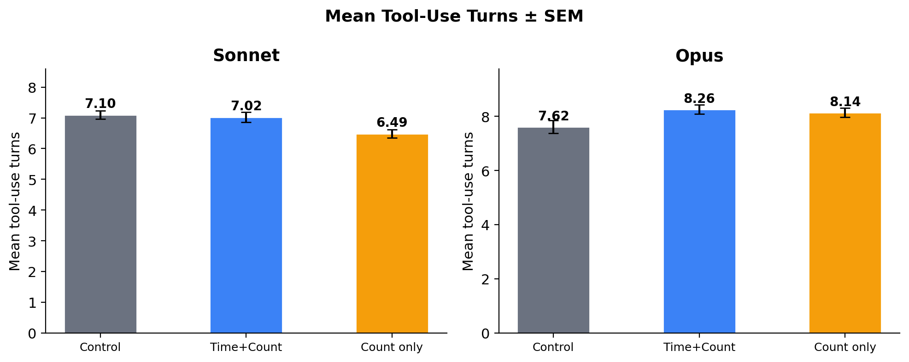
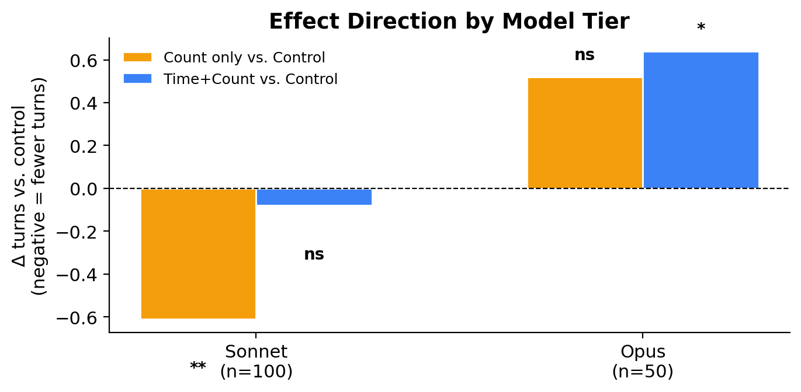

# Results

## Solve Rate

Solve rate was identical across all groups and both models. For Sonnet, Groups A–C resolved 98–100% of problems (Group A: 100/100; Group B: 99/100; Group C: 99/100); Group D (post-hoc ablation, n=50) resolved 98% (49/50). For Opus, all three main groups resolved 100% of problems (50/50 each). Fisher's exact tests revealed no significant differences between any pair of groups for either model (all p > 0.5). Injecting temporal signals — whether elapsed time, attempt count, or both — had no measurable effect on whether the agent ultimately solved the problem.

## Tool-Use Turns

The effect on tool-use turns diverged sharply across model tiers.

**Sonnet.** Group C (attempt count only) used significantly fewer turns than the control (Group A): mean 6.49 vs. 7.10, Mann-Whitney U = 1530, p = 0.0035, Cohen d = 0.45. Group B (time + attempt count) did not differ significantly from control: mean 7.02 vs. 7.10, U = 1348, p = 0.52, d = 0.05. The difference between Group B and Group C was significant (p = 0.039, d = 0.35), with Group C being the more efficient condition. Group D (instruction only, no temporal signal; n = 50) did not differ significantly from the control: mean 6.74 vs. 7.10, p = 0.29, d = 0.27, Δ = +0.25 turns relative to Group C.

| Group | Condition | n | Mean turns | SD | vs. A (p) | d |
|-------|-----------|---|-----------|-----|-----------|---|
| A | Control | 100 | 7.10 | 1.35 | — | — |
| B | Time + count + instruction | 100 | 7.02 | 1.64 | 0.52 ns | 0.05 |
| C | Count + instruction | 100 | 6.49 | 1.37 | 0.003 ** | 0.45 |
| D | Instruction only, no signal | 50 | 6.74 | 1.32 | 0.29 ns | 0.27 |

*Table 1. Sonnet results. Groups A–C: n = 100/group, runs 1+2 pooled. Group D: n = 50, post-hoc instruction ablation.*

*Figure 1. Distribution of tool-use turns per group for Sonnet (left) and Opus (right). White dots indicate means. Significance brackets show Mann-Whitney U tests (** p<0.01, * p<0.05).*

**Opus.** The pattern reversed. Group B (time + attempt count) used significantly more turns than control: mean 8.26 vs. 7.62, U = 912, p = 0.012, d = 0.44. Group C (attempt only) trended in the same direction but did not reach significance: mean 8.14 vs. 7.62, p = 0.097, d = 0.36. Group B and Group C did not differ from each other (p = 0.49).

| Group | Condition | Mean turns | SD | vs. A (p) | d |
|-------|-----------|-----------|-----|-----------|---|
| A | Control | 7.62 | 1.70 | — | — |
| B | Time + attempt | 8.26 | 1.16 | 0.012 * | 0.44 |
| C | Attempt only | 8.14 | 1.17 | 0.097 ns | 0.36 |

*Table 2. Opus results (n = 50/group).*

*Figure 2. Mean tool-use turns ± SEM by group and model. Error bars show standard error of the mean.*

*Figure 3. Delta turns vs. control by condition and model. Negative = fewer turns than control. The effect direction reverses between Sonnet and Opus. (** p<0.01, * p<0.05, ns = not significant)*

## Replication Consistency

For Sonnet, runs 1 and 2 produced consistent means across all groups: Group A mean 7.08 (run 1) vs. 7.12 (run 2); Group B 6.90 vs. 7.14; Group C 6.28 vs. 6.70. The maximum inter-run delta was 0.42 turns (Group C), within one standard deviation. The directional pattern — C < A — was present in both runs independently.

## Instruction Ablation (Group D)

Group D was run after the initial paper draft to isolate whether the Group C effect is attributable to the instruction framing or to the count signal `[attempt: 1/5]`. Group D carried an instruction-only system prompt — *"You are a debugging assistant. As you work, if you're not making progress, try a fundamentally different approach"* — with no prefix token and no temporal signal. This instruction differs from Group B (which mentions temporal signals explicitly) and from Group C (which primes the model to expect attempt count).

Group D (Sonnet, n = 50) produced a mean of 6.74 turns (SD = 1.32), which did not differ significantly from the control: p = 0.29 (ns), Cohen d = 0.27. This places Group D squarely between Groups A and C, and numerically above Group C by 0.25 turns (D vs. C: p = 0.15 ns). The instruction alone does not replicate the Group C reduction. The count signal `[attempt: 1/5]` is the active ingredient.

This result closes the main confound identified in the original design. The presence of an additional instruction in Group B and Group C was a potential alternative explanation for the Group C effect — if the model simply responds to any additional framing by behaving differently, Group C's advantage might not be due to the count signal per se. Group D rules this out: the instruction framing without the count signal produces no significant reduction.

## Turns by Bug Type

Across both models and all groups, problems classified as "excess logic" required the most turns on average (Sonnet Group A: 9.0; Opus Group A: 9.4), while "function misuse" and "variable misuse" required the fewest (Sonnet Group A: 6.0–7.0). The treatment effects were consistent in direction across bug types, with no single bug type driving the group differences.
